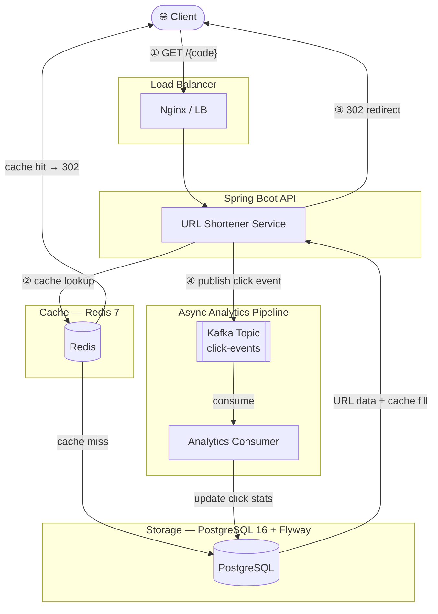

# URL Shortener

[](https://github.com/mhtpsd/url-shortener/actions/workflows/ci.yml)
[](https://openjdk.java.net/projects/jdk/17/)
[](https://spring.io/projects/spring-boot)
[](https://opensource.org/licenses/MIT)


A **production-grade URL shortener** built with Spring Boot, Redis cache-aside architecture, and an asynchronous Kafka-driven analytics pipeline — designed for high throughput and horizontal scalability.

---

## 🏗️ Architecture



**Key design decisions:**
- **Cache-aside**: Redis caches shortened URLs (TTL 10 min). Misses fall back to PostgreSQL.
- **Async analytics**: Click events are published to Kafka and consumed by an analytics worker — keeping redirects fast (sub-10 ms P99).
- **Atomic counters**: `UPDATE … SET click_count = click_count + 1` avoids lost updates under concurrent traffic.
- **Base62 encoding**: Auto-generated short codes are Base62 of the auto-incremented DB ID (e.g., ID 1 → `"1"`, ID 1 billion → `"15FTGg"`).

---

## ✨ Features

- ⚡ **Sub-10ms P99 redirects** — Redis cache-aside keeps hot URLs in memory
- 📊 **Async analytics** — Kafka decouples click tracking from redirect latency
- 🔗 **Custom aliases** — users can choose vanity short codes
- 📱 **QR code generation** — instant QR codes for any shortened URL
- 🛡️ **Rate limiting** — per-IP request throttling via Redis
- 🗄️ **Zero-downtime migrations** — Flyway manages schema evolution
- ☸️ **Kubernetes-ready** — Kustomize overlays for dev/prod, HPA autoscaling
- 🧪 **Testcontainers** — integration tests with real PostgreSQL, Redis, Kafka

---

## 📡 API Endpoints

| Method | Endpoint | Description |
|--------|----------|-------------|
| `POST` | `/api/v1/urls` | Create shortened URL (with optional custom alias) |
| `GET` | `/api/v1/urls/{code}` | Get URL metadata & stats |
| `GET` | `/{code}` | Redirect to original URL (302) |
| `GET` | `/api/v1/urls/{code}/qr` | Generate QR code for short URL |
| `GET` | `/api/v1/urls/{code}/stats` | Get click analytics |

---

## 🔧 Tech Stack

| Layer | Technology |
|-------|-----------|
| Language | Java 17 |
| Framework | Spring Boot 3.2 (Web, Data JPA, Validation, Cache, Actuator) |
| Database | PostgreSQL 16 + Flyway |
| Cache | Redis 7 (Lettuce client) |
| Messaging | Apache Kafka 3.6 |
| API Docs | SpringDoc OpenAPI 2.3 (Swagger UI) |
| QR Codes | ZXing 3.5 |
| Testing | JUnit 5, Mockito, Testcontainers |
| Build | Maven 3.9 + Maven Wrapper |
| Containers | Docker + Docker Compose |
| Orchestration | Kubernetes + Kustomize |
| CI/CD | GitHub Actions |

---

## 🚀 Quick Start

### Prerequisites
- Docker & Docker Compose

```bash
git clone https://github.com/mhtpsd/url-shortener.git
cd url-shortener
docker compose up -d
```

The API will be available at `http://localhost:8080`.

### Local Development (without Docker)

**Requirements:** Java 17, Maven 3.9+, PostgreSQL 16, Redis 7, Kafka

```bash
# Start infrastructure
docker compose up -d postgres redis kafka zookeeper

# Run the application (dev profile)
./mvnw spring-boot:run -Dspring-boot.run.profiles=dev
```

---

## 📡 API Reference

Swagger UI: **`http://localhost:8080/swagger-ui.html`**
OpenAPI JSON: `http://localhost:8080/api-docs`

### Shorten a URL

```http
POST /api/v1/urls
Content-Type: application/json

{
  "url": "https://www.example.com/very/long/path?with=query&params=true",
  "customAlias": "my-link",       // optional
  "expiresAt": "2025-12-31T23:59:59Z"  // optional
}
```

**Response `201 Created`:**
```json
{
  "shortCode": "my-link",
  "shortUrl": "http://localhost:8080/my-link",
  "originalUrl": "https://www.example.com/very/long/path?with=query&params=true",
  "createdAt": "2024-01-15T10:30:00Z",
  "expiresAt": "2025-12-31T23:59:59Z"
}
```

### Redirect

```http
GET /{shortCode}
→ 302 Found  (Location: <original URL>)
→ 404 Not Found
→ 410 Gone   (expired)
```

### Bulk Create

```http
POST /api/v1/urls/bulk
Content-Type: application/json

{
  "urls": [
    { "url": "https://example.com/1" },
    { "url": "https://example.com/2" }
  ]
}
```

### Get URL Info

```http
GET /api/v1/urls/{shortCode}
```

### Disable a URL

```http
DELETE /api/v1/urls/{shortCode}
→ 204 No Content
```

### QR Code

```http
GET /api/v1/urls/{shortCode}/qr
→ 200 OK  Content-Type: image/png
```

### Analytics

```http
GET /api/v1/analytics/{shortCode}          # full stats (by date, country, device, browser)
GET /api/v1/analytics/{shortCode}/summary  # click count only
```

---

## 🗄️ Database Schema

Managed by **Flyway** (`V1__create_tables.sql`):

```sql
shortened_urls  — id, short_code, original_url, custom_alias, created_at,
                  expires_at, click_count, status, created_by_ip
click_events    — id, short_code, clicked_at, ip_address, user_agent,
                  referer, country, device_type, browser, os
```

---

## ⚙️ Configuration

Key environment variables (see `application.yml`):

| Variable | Default | Description |
|----------|---------|-------------|
| `DB_HOST` | `localhost` | PostgreSQL host |
| `DB_NAME` | `urlshortener` | Database name |
| `DB_USER` | `postgres` | DB username |
| `DB_PASSWORD` | `postgres` | DB password |
| `REDIS_HOST` | `localhost` | Redis host |
| `KAFKA_BOOTSTRAP_SERVERS` | `localhost:9092` | Kafka servers |
| `APP_BASE_URL` | `http://localhost:8080` | Base URL for short links |
| `RATE_LIMIT_RPM` | `100` | Max requests per minute per IP |

---

## 🧪 Testing

```bash
# Unit tests only
./mvnw test -Dtest="Base62EncoderTest,UrlServiceTest,AnalyticsServiceTest,UrlControllerTest,RedirectControllerTest,ClickEventProducerTest"

# Integration tests (requires Docker for Testcontainers)
./mvnw test -Dtest="UrlShortenerIntegrationTest"

# All tests
./mvnw test
```

---

## 🐳 Docker

```bash
# Build image
docker build -t url-shortener:latest .

# Run with Docker Compose (dev)
docker compose up -d

# Run with Docker Compose (prod)
docker compose -f docker-compose.prod.yml up -d
```

---

## ☸️ Kubernetes

```bash
# Deploy to dev
kubectl apply -k k8s/overlays/dev

# Deploy to prod
kubectl apply -k k8s/overlays/prod

# Check status
kubectl get pods -n url-shortener
```

---

## 📊 Monitoring

Spring Actuator endpoints (exposed in production: health, metrics, prometheus):

- `GET /actuator/health`
- `GET /actuator/metrics`
- `GET /actuator/prometheus`

---

## 📁 Project Structure

```
src/main/java/com/mohitprasad/urlshortener/
├── config/          # Redis, Kafka, Rate Limiting configuration
├── controller/      # REST API endpoints
├── exception/       # Global exception handling
├── kafka/           # Kafka producer & consumer
├── model/           # JPA entities & DTOs
├── repository/      # Spring Data JPA repositories
├── service/         # Business logic & caching
└── util/            # Base62 encoder, QR generator

k8s/
├── base/            # Deployments, Services, ConfigMaps
├── overlays/        # Kustomize dev & prod patches
└── namespace.yaml
```

---

## 📄 License

MIT © [Mohit Prasad](https://github.com/mhtpsd)

